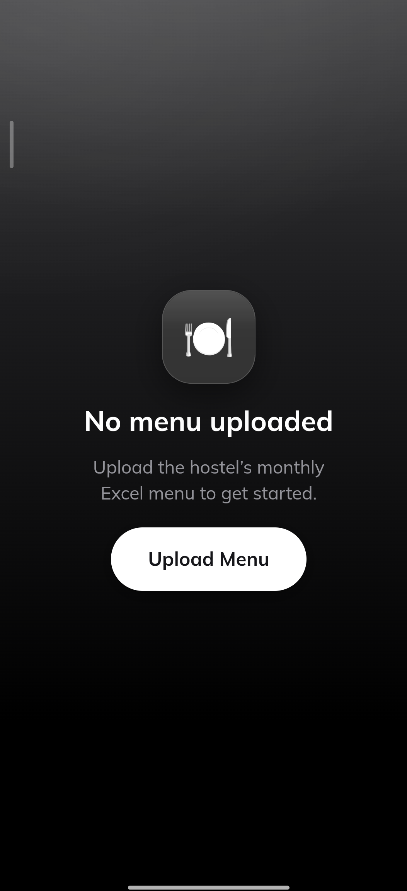
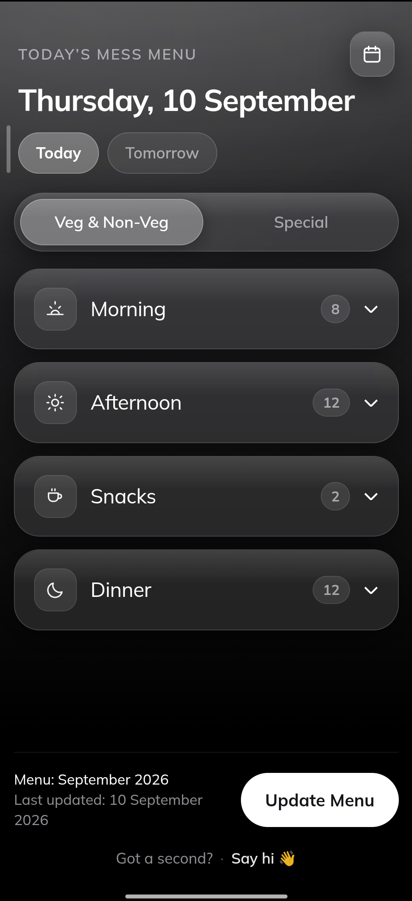
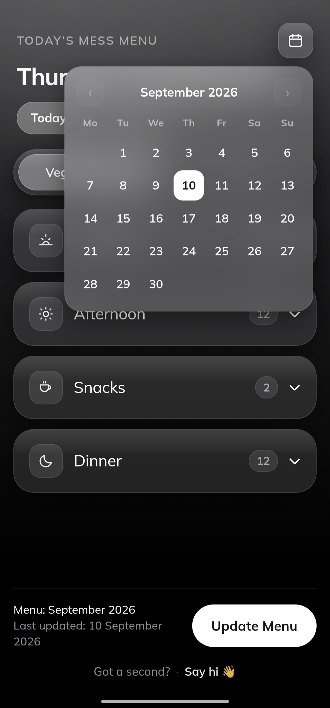

# Mess Menu

A tiny offline Android app: upload your hostel's monthly Excel menu once, and it
shows **today's** menu every time you open it.

No login, no account, no backend, no internet. The date comes from your phone,
the menu comes from local storage on your phone.

## Screenshots

|  |  |  |

---

## How it works

```
src/lib/parseMenu.js    Excel -> { date -> meals }   (all the format knowledge lives here)
src/lib/storage.js      save/load on the device      (Capacitor Preferences)
src/App.jsx             today's screen
src/components/         meal card
scripts/test-parser.mjs parser tests against a real workbook
```

The parser is deliberately separate from the UI. If the hostel changes the Excel
layout next year, `parseMenu.js` is the only file that needs touching.

### The screen

Warm brown glassmorphism: a layered espresso background with translucent,
blurred panels over it. Committed dark theme — no light mode.

Type is **Mulish** — the font Google published as "Muli" until it renamed the
family in 2020. It is self-hosted from `@fontsource-variable/mulish` rather than
pulled from the Google Fonts CDN, so the app still renders correctly with no
internet. One variable file covers every weight, and only the two latin subsets
are declared (57 KB total; Cyrillic and Vietnamese are left out). Mulish is
SIL Open Font License, so bundling it is fine.

The four meals open as headings only (`Morning / Afternoon / Snacks / Dinner`,
each with an item count), so the whole day fits on screen without scrolling. Tap
a heading to expand that meal; several can be open at once. Older Android
WebViews that lack `backdrop-filter` get an opaque brown panel instead of a
blurred one, so text never lands on an unreadable background.

Under the date sit **Today** and **Tomorrow** chips — tomorrow's menu is one tap,
with no date to pick. The calendar button in the top right reaches any other day.

That calendar is a small in-app component (`components/DatePicker.jsx`), not an
`<input type="date">`. The native picker is drawn by the browser *outside* the
page, so CSS cannot theme it; a plain-markup calendar keeps the brown glass look
and behaves identically on Android and desktop. It marks today with a ring and
the viewed day with a filled pill, greys out days the loaded menu has nothing
for, and its month arrows are clamped to the months the menu covers. It closes
on select, on Escape, or on a tap outside.

The app always opens on today — a chosen date is never persisted.

### What the parser understands

The hostel workbook is **not** one row per day. The parser handles:

| Excel reality | How it is handled |
|---|---|
| Two sheets: `Veg & Non-Veg` and `Special` | Kept as two separate categories with a toggle at the top of the screen. They are near-duplicates (Special adds juices, cereal and soups), so merging them would just show everything twice. |
| Day cell reads `Mon` + newline + `7, 21` | Split into weekday + day numbers. The same menu block is attached to **both** the 7th and the 21st. `1, 15, 29` attaches to three dates. |
| One day spans ~13 rows, day cell merged down column A | The merged range defines the block. Every row inside it is collected. |
| Items appear rows below the day cell with blanks in between (e.g. `Egg Bhurji`) | Still collected — blank day cells never end a block. |
| A `MESS SERVICE INSTRUCTIONS` paragraph sits below the last day | Excluded, because it falls outside every merged day range. |
| Title says `SEPTEMBER` but never the year | The year is inferred by checking which year makes the workbook's own weekday labels line up with the real calendar (falls back to the filename, then the current year). |
| Meal columns `Breakfast / Lunch / Snacks / Dinner` | Found by header text, not by position, so column order can change. |

Nothing about September or any menu item is hardcoded. Next month's file just
works.

### Dates

Date keys are built from `getFullYear()/getMonth()/getDate()` — the device's local
calendar — and never from UTC or ISO string slicing, so the displayed day cannot
drift by a timezone. The date also refreshes when the app returns to the
foreground, so leaving it open overnight still shows the right day.

---

## Commands

### 1. Install dependencies

```bash
npm install
```

### 2. Run in a browser (fast iteration)

```bash
npm run dev
```

Opens on http://localhost:5173. The upload button works here too.

### 3. Test the parser against a real workbook

```bash
npm run test:parser
```

Or point it at any other month's file:

```bash
node scripts/test-parser.mjs "path/to/October 2026.xlsx"
```

### 4. Build the web app and sync it into the Android project

```bash
npm run android:sync
```

### 5. Generate the APK

```bash
npm run android:apk
```

That runs the Vite build, syncs it, and then Gradle's `assembleDebug`.

Prefer Android Studio? Use `npm run android:open`, then **Build > Build Bundle(s) /
APK(s) > Build APK(s)**.

### 6. Find the generated APK

```
android/app/build/outputs/apk/debug/app-debug.apk
```

### 7. Install it on your phone

Either copy that `.apk` file to the phone (USB, Google Drive, WhatsApp to
yourself) and tap it — Android will ask you to allow installs from that app —
or with USB debugging on:

```bash
adb install -r android/app/build/outputs/apk/debug/app-debug.apk
```

`-r` reinstalls over an existing copy without losing the saved menu.

---

## Android SDK / Java / Gradle setup

Gradle itself needs no install — the project ships a wrapper (`gradlew.bat`,
Gradle 8.2.1). You do need two things this machine does not have yet:

**1. JDK 17** (Gradle 8.2 / Android Gradle Plugin 8.2 require exactly 17, not 21+)

Easiest is to install Android Studio, which bundles one at
`C:\Program Files\Android\Android Studio\jbr`. Otherwise grab
[Temurin 17](https://adoptium.net/temurin/releases/?version=17) and set:

```bash
setx JAVA_HOME "C:\Program Files\Eclipse Adoptium\jdk-17.x.x-hotspot"
```

**2. Android SDK** — install [Android Studio](https://developer.android.com/studio),
open it once and let it download the SDK, then in **SDK Manager** make sure
*Android SDK Platform 34* and *Android SDK Build-Tools 34* are ticked
(`compileSdk`/`targetSdk` are 34; `minSdk` is 22, so Android 5.1 and up).

Then point Gradle at the SDK, either with an environment variable:

```bash
setx ANDROID_HOME "%LOCALAPPDATA%\Android\Sdk"
```

or by creating `android/local.properties`:

```
sdk.dir=C\:\\Users\\sidha\\AppData\\Local\\Android\\Sdk
```

Open a **new** terminal after `setx` so the variables are picked up, then run
`npm run android:apk`. The first build downloads Gradle and dependencies and
takes a few minutes; later builds are quick.

A debug APK is signed with a throwaway debug key. That is fine for installing on
your own phone. It is only Play Store publishing that would need a release key.

---

## Notes

- `xlsx` is pulled from SheetJS's own registry (`cdn.sheetjs.com`) rather than
  npm, because the newest version on npm (0.18.5) has two unpatched advisories.
  If that URL is ever unreachable, `npm i xlsx` still works — it just reintroduces
  those advisories.
- The remaining `npm audit` findings are all in dev-only tooling (Vite/esbuild,
  the Capacitor CLI's `tar`). None of it ships inside the APK.
- The upload dialog's file filter is deliberately loose, because Android file
  managers often report an `.xlsx` that arrived via WhatsApp or Gmail as
  `application/octet-stream` and would otherwise grey it out. Anything that is
  not `.xlsx` is rejected with a plain message once picked.
